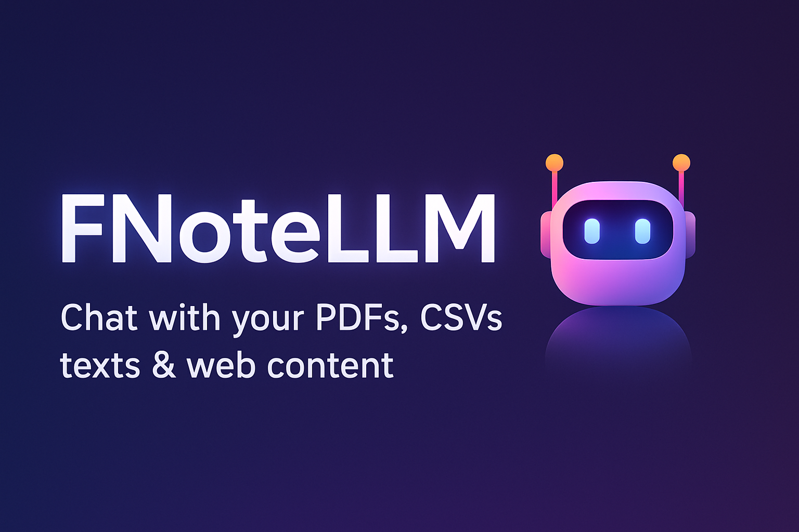

# FNoteLLM

[](https://fnotellm-5o12xiijt-androkingdoms-projects.vercel.app/)

**A personal Notebook AI — chat with your PDFs, CSVs, text, and links in a single session.**

---

## 🚀 Live Demo

[🌐 Try it Live](https://fnotellm-5o12xiijt-androkingdoms-projects.vercel.app/)

---

## 📝 Description

FNoteLLM is a **Next.js + LangChain-powered AI notebook** that allows you to:

- Upload **PDFs, CSVs, or paste text**
- Share **links to web content**
- Ask questions about your documents
- Get **source-aware responses**

Currently, the app supports **one active chat session per user**, so all conversation context and sources are kept in a single session.

---

## ⚡ Features

- ✅ Upload and ingest PDFs, CSVs, text, and links
- ✅ User-specific document embeddings (via cookies)
- ✅ Chat with documents in a notebook-style interface
- ✅ Source references included in responses
- ✅ Fixed chat input with scrollable window
- ✅ Light/Dark mode toggle

---

## 🛠️ Tech Stack

- **Next.js 15 (SSR)** — full server-side rendering
- **Tailwind CSS + ShadCN** — clean, responsive UI
- **Redux Toolkit** — chat state management
- **LangChain + Google Gemini** — AI responses
- **Pinecone** — vector database for embeddings
- **Sonner** — toast notifications

---

## 📦 Installation

```bash
# Clone repo
git clone https://github.com/yourusername/fnotellm.git
cd fnotellm

# Install dependencies
npm install

# Start dev server
npm run dev
```

---

## ⚙️ Usage

1. Open the app in your browser.
2. Upload a PDF, CSV, paste text, or provide a link.
3. Ask questions in the chat input.
4. View answers with **source references**.
5. All conversation context is stored in **one session per user**.

---

## 🗂️ Project Structure

```
/app
 ├─ page.jsx          # Main page layout
 ├─ components
 │   ├─ ChatWindow.jsx
 │   ├─ ChatInput.jsx
 │   ├─ left-col       # Sidebar + upload components
 │   └─ shared         # theme toggle & provider
 ├─ services           # ingestion & chat services
 └─ api                # server routes
/lib
 ├─ features/chat      # redux slice
 └─ utils/hooks.js, store.js, getUserId.js
```

---

## 💡 Notes

- Make sure to add your **Google Gemini API key** in `.env.local`.
- Only **one active chat session per user** is supported.
- User IDs are handled via **cookies** for per-user embeddings.

---

## 🤝 Contributing

Feel free to open issues or submit pull requests.

---

## 📜 License

MIT License — see `LICENSE` file.

---

### 👀 Fun Fact

Yes… I **myself didn’t add a README** when I started 😂.
Polished it now, thanks to GPT Sensei’s secret polishing skills.
